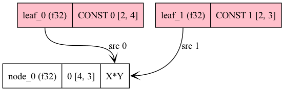

## simple-backend vs simple-ctx (context)
The `simple-ctx` doesn't support gpu acceleration. `simple-backend` demonstrates how to use other backends like CUDA and Metal.

## debug with graphviz
in C++ code, add below to print graph in terminal
```
ggml_graph_print(gf);
```

Or add below to generate dot file
```
ggml_graph_dump_dot(gf, NULL, "debug.dot");
```

on macOS
```
brew install graphviz
```

For Linux
```
sudo apt-get update
sudo apt-get install graphviz
```

To generate png file from dot file
```
dot -V # check version
dot -Tpng simple-ctx.dot -o simple-ctx.dot.png
```



## References
- [HF tutorial](https://huggingface.co/blog/introduction-to-ggml)